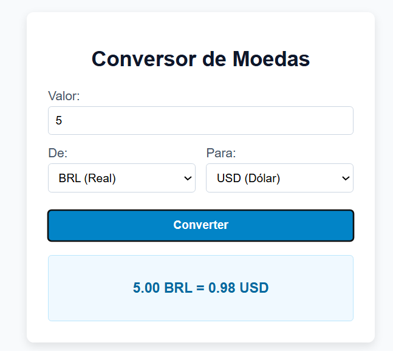

# 💱 Conversor de Moedas

Um conversor de moedas simples e funcional, desenvolvido em **HTML, CSS e JavaScript puro (vanilla)**, sem uso de frameworks ou bibliotecas externas. O projeto consome uma API pública para trazer cotações de câmbio atualizadas em tempo real.

🔗 **[Acesse o projeto online](https://mob-02.github.io/conversor-moedas/)** <!-- Substitua o # pelo link do GitHub Pages -->

## 📸 Demonstração


 -->

## ✨ Funcionalidades

- Conversão entre diferentes moedas (BRL, USD, EUR, GBP)
- Cotações atualizadas em tempo real via API
- Suporte à tecla **Enter** para converter, além do clique no botão
- Validação de valores inválidos ou vazios
- Feedback visual de carregamento e tratamento de erros de conexão

## 🛠️ Tecnologias utilizadas

- **HTML5** — estrutura da página
- **CSS3** — estilização e layout
- **JavaScript (ES6+)** — lógica de conversão, manipulação do DOM e requisições assíncronas (`fetch`/`async-await`)
- **[ExchangeRate API](https://www.exchangerate-api.com/)** (open.er-api.com) — fonte das cotações de câmbio

## 🚀 Como executar localmente

1. Clone o repositório:
   ```bash
   git clone https://github.com/Mob-02/conversor-moedas.git
   ```
2. Entre na pasta do projeto:
   ```bash
   cd conversor-moedas
   ```
3. Abra o arquivo `index.html` no navegador (ou use a extensão **Live Server** no VS Code).

## 📁 Estrutura do projeto

```
conversor-moedas/
├── index.html   # Estrutura da página
├── style.css    # Estilização
└── script.js    # Lógica de conversão
```

## 🎯 Próximos passos

- [ ] Adicionar mais opções de moedas
- [ ] Salvar histórico de conversões com `localStorage`
- [ ] Melhorar o tratamento de erros da API

## 👤 Autor

Desenvolvido por [Marcelo Oliveira](https://github.com/Mob-o2) como parte de um portfólio de projetos em JavaScript vanilla.

<!-- Sinta-se à vontade para conectar comigo no LinkedIn: link-do-linkedin --> www.linkedin.com/in/marcelo-oliveira-5b2493223
